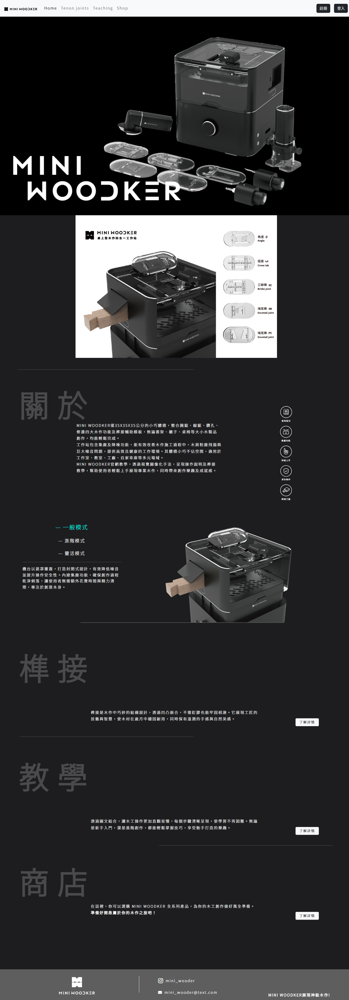
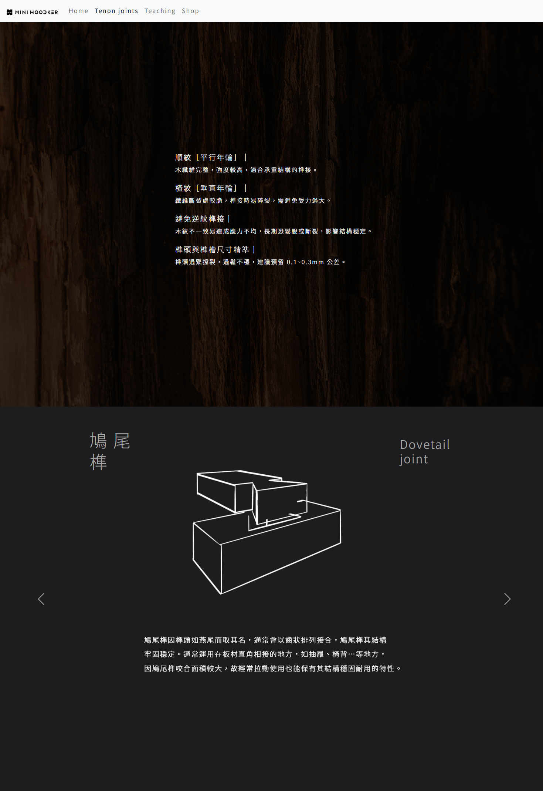
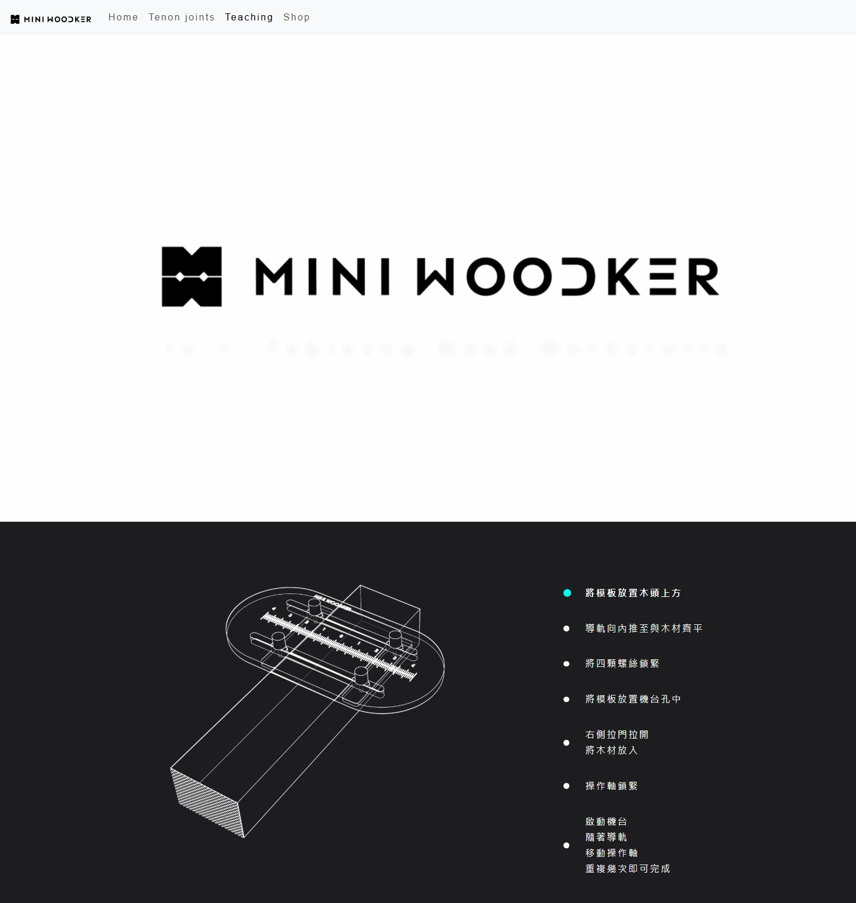
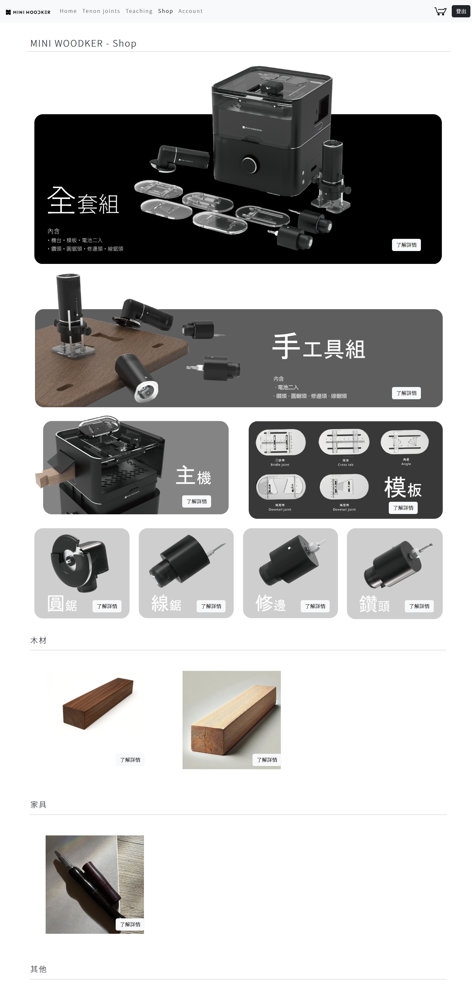
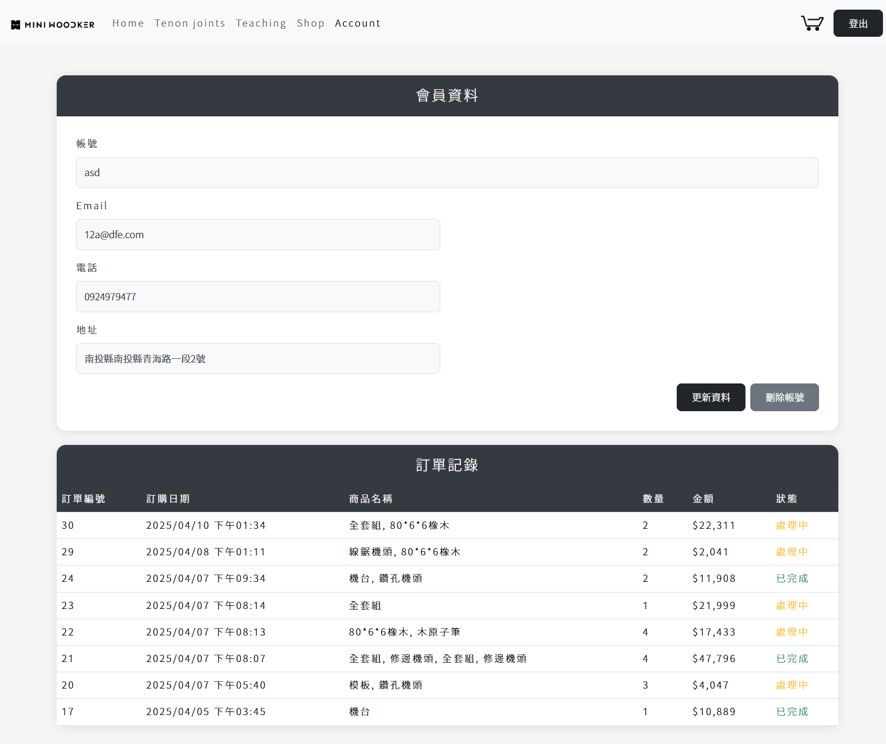

# MINI WOODKER 專案介紹

MINI WOODKER 是一個結合前台與後台的木工產品銷售平台，提供完整的會員註冊、登入、購物車、商品管理、訂單追蹤與視覺化統計圖表功能。

---

## 🎨 Figma 設計稿

👉 [點此觀看介面設計](https://www.figma.com/proto/qnSKR98pa1z0hmfHFJxlo1/MINIWOODKER?node-id=28-88&p=f&t=fjo6yRHG3mmgTiR3-1&scaling=min-zoom&content-scaling=fixed&page-id=0%3A1&starting-point-node-id=28%3A88)

---

## 📌 使用技術

- 前端：HTML、CSS（Bootstrap）、JavaScript（jQuery）、**Vue.js**
- 後端：PHP（原生撰寫）
- 資料庫：MySQL
- 資料傳輸格式：AJAX (jQuery) + JSON
- 圖表套件：Chart.js
- 提示互動：SweetAlert2

---

## 📄 頁面介紹

| 頁面功能       | 說明 |
|---------------|------|
| 首頁          | 首頁介紹、品牌理念、模式說明、教學、商店入口 |
| 榫接教學      | 介紹三缺榫、搭接榫、鳩尾榫等三種榫接結構 |
| 操作教學      | 使用 Vue.js 互動步驟引導，圖文並茂地介紹操作 |
| 商品頁面      | 顯示所有產品分類，可點擊查看詳情並加入購物車 |
| 購物車        | 顯示目前加入的商品、數量調整與結帳功能 |
| 管理者後台    | 管理者專用，包含會員、商品、訂單與圖表分析 |
| 會員設定      | 會員可查看個人資料與訂單紀錄，進行修改或刪除 |

---

## 🧩 系統功能說明

### 🛍 前台功能（使用者）

- 使用者註冊 / 登入 / 登出
- 瀏覽商品 → 加入購物車 → 結帳
- 操作教學（Vue 互動步驟）
- 榫接說明介紹頁面
- 會員可查看與修改資料、查詢訂單

### 🧑‍💼 後台功能（管理員）

- 登入後自動顯示歡迎名稱
- 商品管理（新增 / 修改 / 刪除）
- 會員管理（篩選、搜尋、修改、刪除）
- 訂單管理（狀態篩選、查詢明細）
- 儀表板圖表統計（會員地區、銷售分佈、近 30 天營收折線圖）

---

### 🔐 登入身份分流機制

所有使用者皆從首頁登入，系統會依據帳號權限自動跳轉至對應頁面：

- 一般會員登入後 → 進入首頁 `miniwoodker_home.html`
- 管理者登入後 → 進入後台 `miniwoodker_admin.html`

---

## 🗃️ 資料庫設計概念

資料表設計符合系統實際需求，整體使用者與產品邏輯如下：

- `member`：會員基本資料（帳號、密碼、聯絡方式、UID）
- `product`：商品類別、名稱、圖片、價格、庫存等
- `cart`：暫存的購物車資料（未結帳前）
- `order`：每筆訂單記錄（含訂單明細與總額）
- `order_detail`：每筆訂單所包含的商品細項

資料操作皆透過 PHP 撰寫的 API 溝通，包括：

- `product_API.php`：新增、更新、讀取商品
- `member_control_API_v1.php`：會員登入、註冊、查詢、修改、刪除
- `car_API.php`：處理購物車、結帳、訂單狀態更新

---

---

# MINI WOODKER 網站展示

## 📷 網站畫面展示

### 🔹 首頁、榫接與教學頁面
| 首頁 Home | 榫接 Tenon joints | 教學 Teaching |
|----------|------------------|----------------|
|  品牌主視覺與導覽內容 |  展示不同榫接結構 |  教學流程清楚易懂，適合初學者 |

---

### 🛒 商店頁面相關功能
| 商店 Shop | 商品詳細畫面 | 購物車 Car |
|-----------|----------------|-------------|
|  產品瀏覽與分類選單 |  產品介紹與圖片放大檢視 |  加入購物車與結帳功能 |

---

### 🔐 會員中心與後台管理
| 會員中心 Users | 商品管理 Admin | 會員管理 Admin |
|---------------|----------------|----------------|
|  查看與修改會員資料 |  商品管理與更新操作 |  管理所有會員帳號 |

| 訂單管理 Admin | 統計分析 Admin |
|----------------|----------------|
|  查看與處理每筆訂單 |  數據圖表呈現銷售與會員資訊 |

## 📬 聯絡方式

如對此專案有任何建議、錯誤回報或想進一步了解，歡迎聯絡：

📧 Email：**nianyu0.n@gmail.com**
